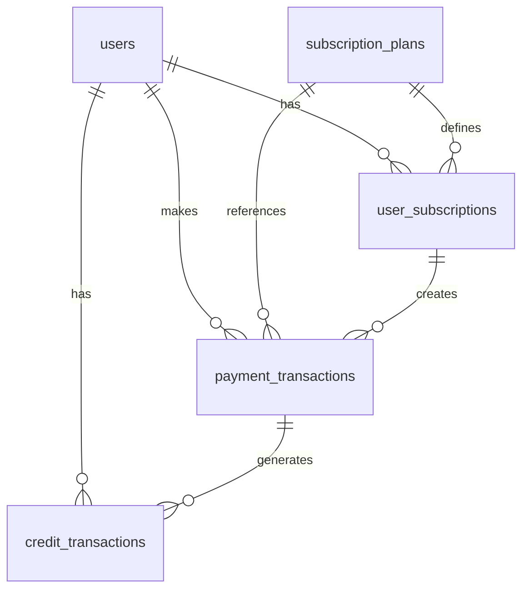
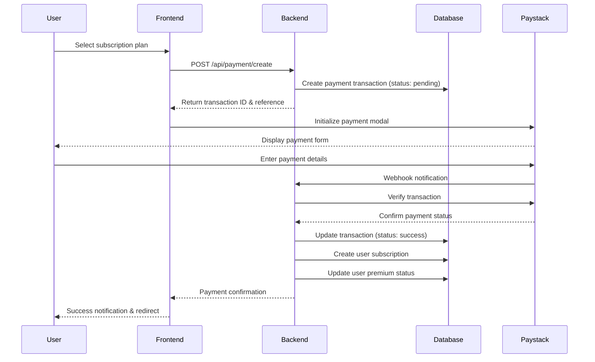
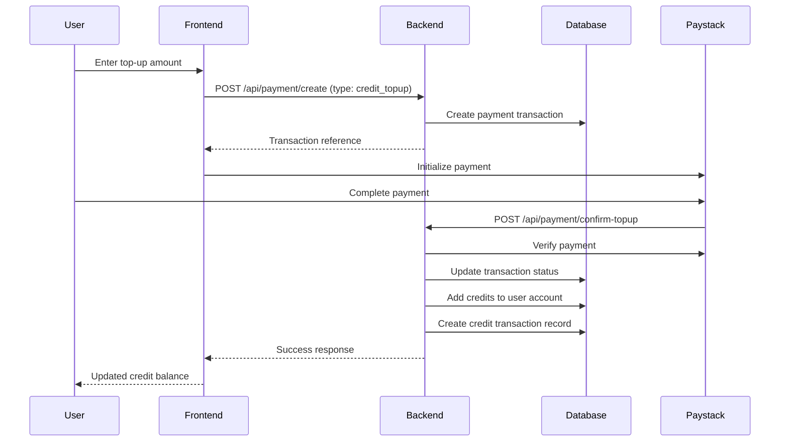

# Daily Sparks Billing System Documentation

## Table of Contents
1. [System Overview](#system-overview)
2. [Architecture Design](#architecture-design)
3. [Database Schema](#database-schema)
4. [Payment Flow](#payment-flow)
5. [API Endpoints](#api-endpoints)
6. [Frontend Components](#frontend-components)
7. [Payment Processing](#payment-processing)
8. [Security Implementation](#security-implementation)
9. [Error Handling](#error-handling)
10. [Testing & Monitoring](#testing--monitoring)

## System Overview

The Daily Sparks billing system implements a comprehensive subscription-based payment architecture with multi-tier pricing, global payment gateway integration, and a flexible credit system. The platform supports three subscription tiers with PPP-adjusted pricing across multiple currencies and payment methods.

### Key Features
- **Three-Tier Subscription Model**: Spark Starter ($4.99), Spark Champion ($14.99), Spark Elite ($24.99)
- **Multi-Payment Gateway Support**: Paystack (primary), Stripe, PayPal, Flutterwave
- **Credit System**: Universal credit balance for top-ups and purchases
- **Global PPP Pricing**: Purchasing Power Parity adjustments for international markets
- **Flexible Billing Cycles**: Weekly, monthly, and yearly billing options
- **Real-time Transaction Tracking**: Complete audit trail for all financial transactions

## Architecture Design

### System Components

```
┌─────────────────────┐    ┌──────────────────────┐    ┌─────────────────────┐
│                     │    │                      │    │                     │
│   Frontend (React)  │◄──►│  Backend (Express)   │◄──►│  Database (PostgreSQL) │
│                     │    │                      │    │                     │
│ • Subscription UI   │    │ • Payment APIs       │    │ • User Data         │
│ • Payment Forms     │    │ • Subscription Logic │    │ • Transactions      │
│ • Credit Management │    │ • Credit System      │    │ • Subscription      │
│                     │    │                      │    │   Plans             │
└─────────────────────┘    └──────────────────────┘    └─────────────────────┘
           │                           │
           │                           │
           ▼                           ▼
┌─────────────────────┐    ┌──────────────────────┐
│                     │    │                      │
│  Payment Gateways   │    │  External Services   │
│                     │    │                      │
│ • Paystack         │    │ • Email Services     │
│ • Stripe           │    │ • Analytics          │
│ • PayPal           │    │ • Monitoring         │
│ • Flutterwave      │    │                      │
│                     │    │                      │
└─────────────────────┘    └──────────────────────┘
```

### Technology Stack
- **Frontend**: React 18, TypeScript, TanStack Query, Tailwind CSS
- **Backend**: Node.js, Express.js, TypeScript
- **Database**: PostgreSQL with Drizzle ORM
- **Payment Processing**: Paystack (primary), Stripe, PayPal
- **Session Management**: Express sessions with PostgreSQL store
- **Authentication**: Session-based with bcrypt password hashing

## Database Schema

### Core Tables

#### 1. `users` Table
Stores user account information and credit balance.

```sql
CREATE TABLE users (
    id VARCHAR PRIMARY KEY DEFAULT gen_random_uuid(),
    email VARCHAR UNIQUE NOT NULL,
    password VARCHAR, -- bcrypt hashed
    first_name VARCHAR,
    last_name VARCHAR,
    profile_image_url VARCHAR,
    is_premium BOOLEAN DEFAULT FALSE,
    credits DECIMAL(10,2) DEFAULT 0.00, -- User credit balance
    is_active BOOLEAN DEFAULT TRUE,
    email_verified BOOLEAN DEFAULT FALSE,
    needs_password_setup BOOLEAN DEFAULT FALSE,
    last_login_at TIMESTAMP,
    created_at TIMESTAMP DEFAULT NOW(),
    updated_at TIMESTAMP DEFAULT NOW()
);
```

#### 2. `subscription_plans` Table
Defines available subscription tiers and pricing.

```sql
CREATE TABLE subscription_plans (
    id VARCHAR PRIMARY KEY DEFAULT gen_random_uuid(),
    name VARCHAR NOT NULL, -- 'Spark Starter', 'Spark Champion', 'Spark Elite'
    code VARCHAR UNIQUE NOT NULL, -- 'basic', 'premium', 'premium_plus'
    description TEXT,
    price DECIMAL(10,2) NOT NULL, -- Base price in USD
    currency VARCHAR DEFAULT 'USD',
    billing_cycle VARCHAR DEFAULT 'weekly', -- 'weekly', 'monthly', 'yearly'
    daily_quiz_limit INTEGER, -- NULL for unlimited
    question_bank_size INTEGER, -- Total questions available
    features JSONB, -- Array of feature strings
    has_ai_personalization BOOLEAN DEFAULT FALSE,
    support_level VARCHAR DEFAULT 'basic', -- 'basic', 'priority', 'premium'
    is_active BOOLEAN DEFAULT TRUE,
    sort_order INTEGER DEFAULT 0,
    created_at TIMESTAMP DEFAULT NOW(),
    updated_at TIMESTAMP DEFAULT NOW()
);
```

#### 3. `user_subscriptions` Table
Tracks active user subscriptions and their status.

```sql
CREATE TABLE user_subscriptions (
    id VARCHAR PRIMARY KEY DEFAULT gen_random_uuid(),
    user_id VARCHAR NOT NULL REFERENCES users(id),
    plan_id VARCHAR NOT NULL REFERENCES subscription_plans(id),
    status VARCHAR NOT NULL DEFAULT 'active', -- 'active', 'expired', 'cancelled', 'pending'
    start_date TIMESTAMP NOT NULL,
    end_date TIMESTAMP NOT NULL,
    auto_renew BOOLEAN DEFAULT TRUE,
    payment_method VARCHAR, -- 'paystack', 'credits', 'stripe'
    paystack_customer_code VARCHAR, -- Paystack customer reference
    paystack_subscription_code VARCHAR, -- Paystack subscription reference
    created_at TIMESTAMP DEFAULT NOW(),
    updated_at TIMESTAMP DEFAULT NOW()
);
```

#### 4. `payment_transactions` Table
Complete audit trail of all payment transactions.

```sql
CREATE TABLE payment_transactions (
    id VARCHAR PRIMARY KEY DEFAULT gen_random_uuid(),
    user_id VARCHAR NOT NULL REFERENCES users(id),
    type VARCHAR NOT NULL, -- 'subscription', 'credit_topup'
    amount DECIMAL(10,2) NOT NULL,
    currency VARCHAR DEFAULT 'USD',
    status VARCHAR NOT NULL DEFAULT 'pending', -- 'pending', 'success', 'failed', 'cancelled'
    description TEXT,
    plan_id VARCHAR REFERENCES subscription_plans(id), -- For subscription payments
    paystack_reference VARCHAR, -- Paystack transaction reference
    paystack_transaction_id VARCHAR, -- Paystack internal transaction ID
    subscription_id VARCHAR REFERENCES user_subscriptions(id),
    metadata JSONB, -- Additional transaction data (billing_cycle, etc.)
    processed_at TIMESTAMP, -- When payment was confirmed
    created_at TIMESTAMP DEFAULT NOW()
);
```

#### 5. `credit_transactions` Table
Tracks all credit movements (top-ups, deductions, refunds).

```sql
CREATE TABLE credit_transactions (
    id VARCHAR PRIMARY KEY DEFAULT gen_random_uuid(),
    user_id VARCHAR NOT NULL REFERENCES users(id),
    type VARCHAR NOT NULL, -- 'topup', 'deduction', 'refund'
    amount DECIMAL(10,2) NOT NULL,
    description TEXT,
    payment_transaction_id VARCHAR REFERENCES payment_transactions(id),
    balance_before DECIMAL(10,2) NOT NULL,
    balance_after DECIMAL(10,2) NOT NULL,
    created_at TIMESTAMP DEFAULT NOW()
);
```

### Database Relationships



## Payment Flow

### 1. Subscription Purchase Flow



### 2. Credit Top-up Flow



## API Endpoints

### Subscription Management

#### `GET /api/subscription/plans`
Returns all active subscription plans.

**Response:**
```json
[
  {
    "id": "plan-123",
    "name": "Spark Champion",
    "code": "premium",
    "description": "For serious students preparing for exams",
    "price": "14.99",
    "currency": "USD",
    "billingCycle": "weekly",
    "dailyQuizLimit": 50,
    "questionBankSize": 2000,
    "features": ["AI personalization", "Advanced analytics", "Priority support"],
    "hasAIPersonalization": true,
    "supportLevel": "priority"
  }
]
```

#### `GET /api/subscription/current`
**Authentication:** Required  
Returns user's current subscription details.

**Response:**
```json
{
  "id": "sub-456",
  "planName": "Spark Champion",
  "planCode": "premium",
  "status": "active",
  "startDate": "2025-01-01T00:00:00Z",
  "endDate": "2025-01-08T00:00:00Z",
  "autoRenew": true,
  "paymentMethod": "paystack",
  "dailyQuizLimit": 50,
  "questionBankSize": 2000,
  "hasAIPersonalization": true,
  "supportLevel": "priority"
}
```

#### `POST /api/subscription/create-with-credits`
**Authentication:** Required  
Creates subscription using user credits.

**Request Body:**
```json
{
  "planId": "plan-123",
  "paymentMethod": "credits",
  "billingCycle": "monthly"
}
```

### Payment Processing

#### `POST /api/payment/create`
**Authentication:** Required  
Initiates a payment transaction.

**Request Body:**
```json
{
  "type": "subscription",
  "planId": "plan-123",
  "billingCycle": "weekly",
  "currency": "USD"
}
```

**Response:**
```json
{
  "transactionId": "txn-789",
  "paystackReference": "ref-abc123",
  "amount": 1499,
  "currency": "USD"
}
```

#### `POST /api/payment/confirm`
**Authentication:** Required  
Confirms a subscription payment and creates subscription.

**Request Body:**
```json
{
  "transactionId": "txn-789",
  "paystackReference": "ref-abc123"
}
```

#### `POST /api/payment/confirm-topup`
**Authentication:** Required  
Confirms credit top-up payment and adds credits to user account.

### Credit Management

#### `GET /api/user/credits`
**Authentication:** Required  
Returns user's current credit balance.

**Response:**
```json
{
  "credits": 25.50
}
```

#### `GET /api/payment/history`
**Authentication:** Required  
Returns user's payment transaction history.

**Response:**
```json
[
  {
    "id": "txn-789",
    "type": "subscription",
    "amount": "14.99",
    "currency": "USD",
    "status": "success",
    "description": "Spark Champion Subscription",
    "planName": "Spark Champion",
    "processedAt": "2025-01-01T10:00:00Z",
    "createdAt": "2025-01-01T09:58:00Z"
  }
]
```

## Frontend Components

### Subscription Management UI

The frontend implements a comprehensive subscription management interface using React and TypeScript.

#### Key Components:

1. **`Subscriptions.tsx`** - Main subscription management page
   - Plan comparison and selection
   - Payment form integration
   - Credit top-up functionality
   - Billing history display

2. **Payment Integration**
   ```typescript
   // Paystack payment initialization
   const initiatePaystackPayment = async (planId: string) => {
     const transaction = await createPaymentTransactionMutation.mutateAsync({
       type: 'subscription',
       planId,
       billingCycle: billingPeriod,
       currency: 'USD'
     });

     const handler = window.PaystackPop.setup({
       key: 'pk_live_xxxxx', // Paystack public key
       email: user.email,
       amount: Math.round(parseFloat(transaction.amount) * 100), // Amount in kobo
       currency: transaction.currency,
       ref: transaction.paystackReference,
       callback: (response) => {
         confirmPaymentMutation.mutate({
           transactionId: transaction.transactionId,
           paystackReference: response.reference
         });
       },
       onClose: () => {
         toast({ title: "Payment cancelled", variant: "destructive" });
       }
     });

     handler.openIframe();
   };
   ```

3. **Credit System UI**
   - Real-time credit balance display
   - Top-up amount input with validation
   - Credit transaction history

## Payment Processing

### Paystack Integration

The system uses Paystack as the primary payment gateway with the following implementation:

#### 1. Payment Initialization
```typescript
// Frontend - Initialize Paystack payment
const script = document.createElement('script');
script.src = 'https://js.paystack.co/v1/inline.js';
script.async = true;
document.body.appendChild(script);

// Setup payment parameters
const handler = window.PaystackPop.setup({
  key: process.env.PAYSTACK_PUBLIC_KEY,
  email: user.email,
  amount: amount * 100, // Convert to kobo (smallest currency unit)
  currency: 'USD',
  ref: transactionReference,
  callback: handlePaymentSuccess,
  onClose: handlePaymentCancellation
});
```

#### 2. Backend Payment Verification
```typescript
// server/routes.ts - Payment confirmation endpoint
app.post('/api/payment/confirm', isAuthenticated, async (req: any, res) => {
  const { transactionId, paystackReference } = req.body;
  
  try {
    // Verify payment with Paystack
    const verification = await fetch(
      `https://api.paystack.co/transaction/verify/${paystackReference}`,
      {
        headers: {
          'Authorization': `Bearer ${process.env.PAYSTACK_SECRET_KEY}`
        }
      }
    );
    
    const verificationData = await verification.json();
    
    if (verificationData.data.status === 'success') {
      // Update transaction status
      await storage.updatePaymentTransaction(transactionId, {
        status: 'success',
        paystackTransactionId: verificationData.data.id,
        processedAt: new Date()
      });
      
      // Create subscription or add credits based on transaction type
      // ... subscription creation logic
    }
  } catch (error) {
    console.error('Payment verification failed:', error);
    res.status(500).json({ message: 'Payment verification failed' });
  }
});
```

### Multi-Gateway Support

The system is architected to support multiple payment gateways:

```typescript
interface PaymentGateway {
  initialize(params: PaymentParams): Promise<string>;
  verify(reference: string): Promise<PaymentStatus>;
  createCustomer(user: User): Promise<string>;
}

class PaystackGateway implements PaymentGateway {
  async initialize(params: PaymentParams): Promise<string> {
    // Paystack implementation
  }
  
  async verify(reference: string): Promise<PaymentStatus> {
    // Paystack verification
  }
}

class StripeGateway implements PaymentGateway {
  // Stripe implementation
}
```

## Security Implementation

### Payment Security

1. **API Key Management**
   - Public keys used on frontend for payment initialization
   - Secret keys stored securely in environment variables
   - Never expose secret keys in client-side code

2. **Transaction Verification**
   - All payments verified server-side using gateway APIs
   - Webhook signatures validated for authentic notifications
   - Transaction references cross-checked between frontend and backend

3. **Session Security**
   ```typescript
   // Authentication middleware
   const isAuthenticated = (req: any, res: any, next: any) => {
     if (!req.session.userId) {
       return res.status(401).json({ message: 'Authentication required' });
     }
     next();
   };
   ```

### Database Security

1. **SQL Injection Prevention**
   - All database queries use parameterized statements via Drizzle ORM
   - Input validation with Zod schemas

2. **Data Encryption**
   - Passwords hashed using bcrypt with 12 salt rounds
   - Sensitive payment data tokenized through gateway systems

3. **Access Control**
   - User-specific data access enforced at API level
   - Admin routes protected with role-based authentication

## Error Handling

### Frontend Error Management

```typescript
// Payment error handling
const handlePaymentError = (error: any) => {
  console.error('Payment error:', error);
  
  const errorMessages = {
    'insufficient_funds': 'Insufficient funds. Please add more credits.',
    'invalid_card': 'Please check your card details and try again.',
    'transaction_failed': 'Transaction failed. Please try again later.',
    'network_error': 'Network error. Please check your connection.'
  };
  
  const message = errorMessages[error.code] || 'An unexpected error occurred';
  
  toast({
    title: 'Payment Error',
    description: message,
    variant: 'destructive'
  });
};
```

### Backend Error Handling

```typescript
// Centralized error handling middleware
app.use((error: any, req: any, res: any, next: any) => {
  console.error('API Error:', {
    endpoint: req.path,
    method: req.method,
    error: error.message,
    stack: error.stack,
    userId: req.session?.userId
  });

  // Don't expose internal errors in production
  const isDevelopment = process.env.NODE_ENV === 'development';
  
  res.status(error.status || 500).json({
    message: isDevelopment ? error.message : 'Internal server error',
    ...(isDevelopment && { stack: error.stack })
  });
});
```

### Database Error Recovery

```typescript
// Transaction rollback on error
const createSubscriptionWithPayment = async (userId: string, planId: string) => {
  const transaction = await db.transaction(async (trx) => {
    try {
      // Create payment record
      const payment = await trx.insert(paymentTransactions).values({
        userId,
        planId,
        amount: planPrice,
        status: 'pending'
      }).returning();

      // Create subscription
      const subscription = await trx.insert(userSubscriptions).values({
        userId,
        planId,
        status: 'active',
        startDate: new Date(),
        endDate: calculateEndDate(billingCycle)
      }).returning();

      return { payment: payment[0], subscription: subscription[0] };
    } catch (error) {
      // Automatic rollback on error
      throw error;
    }
  });

  return transaction;
};
```

## Testing & Monitoring

### Payment Testing

1. **Sandbox Environment**
   ```typescript
   const PAYSTACK_CONFIG = {
     publicKey: process.env.NODE_ENV === 'production' 
       ? process.env.PAYSTACK_PUBLIC_KEY_LIVE
       : process.env.PAYSTACK_PUBLIC_KEY_TEST,
     secretKey: process.env.NODE_ENV === 'production'
       ? process.env.PAYSTACK_SECRET_KEY_LIVE  
       : process.env.PAYSTACK_SECRET_KEY_TEST
   };
   ```

2. **Test Card Numbers**
   - Successful payment: 4084084084084081
   - Insufficient funds: 4084084084084099
   - Invalid expiry: Any expired date

### Monitoring & Analytics

1. **Transaction Monitoring**
   ```sql
   -- Daily transaction summary
   SELECT 
     DATE(created_at) as date,
     COUNT(*) as total_transactions,
     COUNT(CASE WHEN status = 'success' THEN 1 END) as successful,
     COUNT(CASE WHEN status = 'failed' THEN 1 END) as failed,
     SUM(CASE WHEN status = 'success' THEN amount ELSE 0 END) as revenue
   FROM payment_transactions 
   WHERE created_at >= CURRENT_DATE - INTERVAL '30 days'
   GROUP BY DATE(created_at)
   ORDER BY date DESC;
   ```

2. **Subscription Metrics**
   ```sql
   -- Active subscriptions by plan
   SELECT 
     sp.name as plan_name,
     COUNT(us.id) as active_subscriptions,
     SUM(CAST(sp.price AS DECIMAL)) as monthly_revenue
   FROM user_subscriptions us
   JOIN subscription_plans sp ON us.plan_id = sp.id
   WHERE us.status = 'active'
   GROUP BY sp.id, sp.name;
   ```

### Performance Monitoring

1. **Database Query Performance**
   - Index on `payment_transactions(user_id, created_at)`
   - Index on `user_subscriptions(user_id, status)`
   - Index on `credit_transactions(user_id, created_at)`

2. **API Response Monitoring**
   ```typescript
   // Response time middleware
   app.use((req, res, next) => {
     const startTime = Date.now();
     
     res.on('finish', () => {
       const responseTime = Date.now() - startTime;
       console.log(`${req.method} ${req.path} - ${responseTime}ms`);
       
       // Alert if response time > 2 seconds
       if (responseTime > 2000) {
         console.warn('Slow API response detected:', {
           endpoint: req.path,
           responseTime,
           userId: req.session?.userId
         });
       }
     });
     
     next();
   });
   ```

---

## Summary

The Daily Sparks billing system provides a robust, secure, and scalable foundation for subscription-based revenue generation. With comprehensive payment gateway integration, detailed transaction tracking, and flexible credit management, the system supports the platform's global expansion while maintaining security best practices and providing excellent user experience.

The modular architecture allows for easy integration of additional payment gateways, currencies, and pricing models as the platform scales internationally. All financial data is properly audited and secured, with real-time monitoring and error handling to ensure reliable operation.