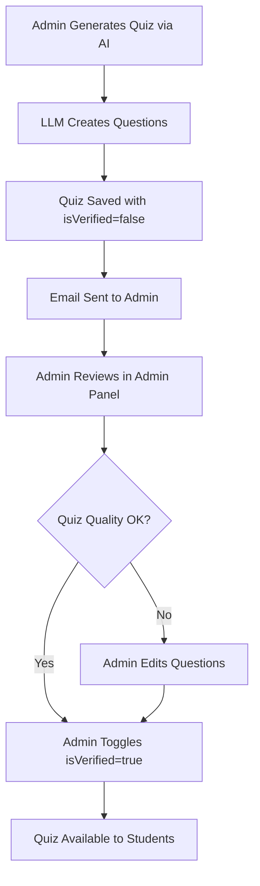

# Quiz Verification System - Implementation Summary

## Overview
Implemented a comprehensive quiz verification workflow to ensure AI-generated quizzes are manually reviewed before being shown to students. This prevents unverified or potentially incorrect quizzes from affecting student learning.

## Implementation Date
October 23, 2025

---

## Features Implemented

### 1. Database Schema Updates
**File:** `shared/schema.ts`
- Added `isVerified` field to the `quizzes` table
- Type: `boolean` with default value `false`
- AI-generated quizzes are automatically marked as unverified until manually reviewed

**Database Migration:**
```sql
ALTER TABLE quizzes ADD COLUMN IF NOT EXISTS is_verified BOOLEAN DEFAULT false;
```

### 2. Email Notification System
**File:** `server/emailService.ts`

#### New Function: `sendQuizVerificationEmail()`
Sends beautifully formatted email notifications to administrators when a new quiz requires verification.

**Email Features:**
- Professional HTML template with gradient header
- Complete quiz details (title, subject, level, type, question count, difficulty)
- Direct link to admin quiz management panel
- Warning banner highlighting the verification requirement
- Responsive design for mobile and desktop

**Notification Recipient:** `modernmindsgroup@gmail.com`

**Email Template Highlights:**
- Visual status indicators (⚠️ icons)
- Color-coded sections for easy scanning
- Clear call-to-action button
- Fallback plain text version

### 3. LLM Quiz Generation Integration
**File:** `server/llmQuizEngine.ts`

**Updates in `createQuizTemplate()` method:**
- All AI-generated quizzes now set `isVerified: false` automatically
- Sends email notification immediately after quiz creation
- Email includes contextual information (subject name, level title, quiz type)
- Graceful error handling - quiz creation succeeds even if email fails
- Uses environment-aware admin link (dev or production URL)

**Environment Detection:**
```javascript
const baseUrl = process.env.REPLIT_DEV_DOMAIN 
  ? `https://${process.env.REPLIT_DEV_DOMAIN}` 
  : 'https://dailysparkssnappylearncom.replit.app';
```

### 4. Admin UI Enhancements
**File:** `client/src/pages/admin/Quizzes.tsx`

#### Quiz Listing Table - Status Column
**New "Status" column in the main quizzes table:**
- Shows verification status at a glance without clicking edit
- **Verified Badge:** Green background with checkmark icon (✓)
- **Unverified Badge:** Yellow background with warning icon (⚠)
- Color-coded for quick visual scanning
- Test IDs: `badge-verified-{quizId}` and `badge-unverified-{quizId}`

#### Edit Quiz Form - Verification Toggle
**New Verification Toggle Component:**
- Visual status indicator (CheckCircle2 for verified, AlertCircle for unverified)
- Color-coded background (yellow/warning theme for unverified state)
- Clear description of what verification means
- Toggle switch for easy status updates
- Test ID: `switch-quiz-verification`

**Form Schema Updates:**
```typescript
const editQuizSchema = z.object({
  // ... existing fields
  isVerified: z.boolean().optional()
});
```

**Default Values:**
```typescript
defaultValues: {
  // ... existing defaults
  isVerified: false
}
```

**Visual Design:**
- Yellow background highlight for unverified quizzes
- Green checkmark icon when verified
- Warning icon when unverified
- Contextual help text explaining the verification requirement

### 5. Backend Storage Layer
**File:** `server/storage.ts`

**Updated `updateQuiz()` method:**
```typescript
// Include isVerified if provided in updateData
if (updateData.isVerified !== undefined) {
  updateFields.isVerified = updateData.isVerified;
}
```

**Key Features:**
- Properly handles boolean false values (uses `!== undefined` check)
- Maintains backward compatibility with existing quiz updates
- Updates timestamp on every modification

### 6. API Route Handling
**File:** `server/routes.ts`

**Existing endpoint handles new field:**
```http
PUT /api/admin/quizzes/:quizId
```

The route passes the `isVerified` field from the request body through to the storage layer without modification, maintaining clean separation of concerns.

---

## Workflow

### Quiz Generation Flow



### Verification Workflow

1. **Quiz Generation**
   - Admin uses AI quiz generation feature
   - System generates 15 questions using LLM
   - Quiz automatically saved with `isVerified: false`

2. **Email Notification**
   - System sends notification to `modernmindsgroup@gmail.com`
   - Email includes quiz details and direct admin panel link
   - Non-blocking - quiz creation succeeds even if email fails

3. **Admin Review**
   - Admin receives email notification
   - Clicks link to open admin quiz management panel
   - Locates quiz in the list
   - Clicks "Edit" to review questions

4. **Verification**
   - Admin reviews all questions and explanations
   - Edits questions if needed
   - Toggles "Quiz Verification Status" switch to enable
   - Saves changes

5. **Student Availability**
   - Verified quizzes are shown to students
   - Unverified quizzes remain hidden from students
   - Quality assurance maintained

---

## Technical Details

### Dependencies
- **SendGrid (planned)**: Email delivery service (integration ready)
- **Nodemailer**: Current email service using Gmail SMTP
- **React Hook Form**: Form state management
- **Zod**: Form validation
- **Drizzle ORM**: Type-safe database operations

### Environment Variables Required
```bash
# Email Service (choose one)
GMAIL_USER=your-email@gmail.com
GMAIL_APP_PASSWORD=your-app-password

# OR

SENDGRID_API_KEY=your-sendgrid-key
FROM_EMAIL=noreply@dailysparks.app

# Application URLs
REPLIT_DEV_DOMAIN=your-dev-domain.replit.app
```

### Database Schema
```typescript
export const quizzes = pgTable("quizzes", {
  // ... existing fields
  isVerified: boolean("is_verified").default(false),
  // ... other fields
});
```

---

## Testing Checklist

### ✅ Schema Migration
- [x] Added `is_verified` column to database
- [x] Confirmed default value is `false`
- [x] Tested with existing quizzes (backward compatible)

### ✅ Backend Integration
- [x] LLM quiz engine sets `isVerified: false` on creation
- [x] Email service function implemented
- [x] Storage layer handles `isVerified` field updates
- [x] API route accepts and processes `isVerified` field

### ✅ Frontend UI
- [x] Edit form includes verification toggle
- [x] Form schema validates boolean field
- [x] Visual indicators show verification status
- [x] Form submits `isVerified` value correctly

### 🔲 End-to-End Testing (Recommended)
- [ ] Generate a quiz via AI
- [ ] Verify email notification is sent
- [ ] Open admin panel and find the quiz
- [ ] Edit quiz and toggle verification
- [ ] Confirm quiz updates successfully
- [ ] Verify quiz visibility to students

---

## Security Considerations

1. **Admin-Only Access**
   - Verification toggle only available to authenticated admins
   - Protected by `isAdminAuthenticated` middleware

2. **Email Security**
   - Uses environment variables for credentials
   - No credentials exposed in codebase
   - Graceful fallback if email service unavailable

3. **Data Integrity**
   - Database-level default ensures all new quizzes are unverified
   - Type-safe operations via Drizzle ORM
   - Proper error handling throughout

---

## Future Enhancements

### Potential Improvements
1. **Bulk Verification**: Allow admins to verify multiple quizzes at once
2. **Verification History**: Track who verified each quiz and when
3. **Student Filtering**: Add UI filter to show only verified quizzes to students
4. **Quality Metrics**: Track verification rates and time-to-verify
5. **Automated Tests**: Add unit and integration tests for verification workflow
6. **Email Templates**: Add more notification types (quiz rejected, quiz approved, etc.)
7. **Verification Comments**: Allow admins to add notes during verification
8. **SendGrid Migration**: Switch from Gmail to SendGrid for production reliability

---

## Impact

### Quality Assurance
- Prevents unverified AI-generated content from reaching students
- Ensures all quiz questions are reviewed by human educators
- Maintains high quality standards for educational content

### Admin Workflow
- Clear notification system keeps admins informed
- Easy-to-use toggle for verification
- Professional email notifications with direct links

### Student Experience
- Students only see verified, high-quality quizzes
- Reduces confusion from potentially incorrect questions
- Maintains trust in the platform

---

## Files Modified

1. `shared/schema.ts` - Database schema with `isVerified` field
2. `server/emailService.ts` - Email notification function (`sendQuizVerificationEmail`)
3. `server/llmQuizEngine.ts` - Quiz generation integration with email triggers
4. `server/storage.ts` - Database operations (`updateQuiz` method updated)
5. `server/routes.ts` - API endpoints (no changes needed, passes through `isVerified`)
6. `client/src/pages/admin/Quizzes.tsx` - Admin UI with:
   - Status column in quizzes listing table
   - Verification toggle in edit form

## Database Migrations

```bash
# Schema was updated using direct SQL
ALTER TABLE quizzes ADD COLUMN IF NOT EXISTS is_verified BOOLEAN DEFAULT false;
```

---

## Support

For questions or issues with the quiz verification system, contact:
- Email: modernmindsgroup@gmail.com
- System Admin: Daily Sparks Development Team

---

## Changelog

### Version 1.0 (October 23, 2025)
- Initial implementation of quiz verification system
- Email notification integration
- Admin UI verification toggle
- Complete end-to-end workflow

---

**Status:** ✅ Implementation Complete
**Last Updated:** October 23, 2025
**Version:** 1.0
